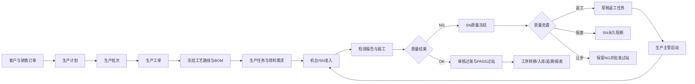

# MES工厂管家：用户角色、业务逻辑与上线差距评估

## 1. 评估结论

当前代码已经具备单工厂MES试点所需的主数据、订单驱动生产、工单任务、报工、库存、质量、设备通讯和SN追溯主链路。AIM机台的NG质量冻结、审核、返工、报废、让步接收及再次NG循环已形成闭环，并用现有测试工单跑通。

系统目前适合在测试环境或单工厂受控试点使用，但不建议立即作为“多客户、多工厂、多人分权”的正式商业版本交付。主要缺口不是页面数量，而是权限隔离、租户隔离、历史脏数据治理、遗留通用CRUD接口和运维能力。

## 2. 当前用户与角色

当前实际数据库只有一个用户：`admin`。迁移后该用户已绑定`admin`角色和默认租户。数据库内只有`admin`、`user`两个角色，普通角色尚未配置菜单权限，因此无法满足正式生产中的职责分离。

建议正式上线前建立以下角色：

| 角色 | 主要职责 | 关键权限 |
|---|---|---|
| 系统管理员 | 用户、角色、菜单、租户、备份、系统配置 | `sys:*`、系统运维 |
| 生产计划员 | 销售订单、计划、批次、工单下达 | `prod:sales:*`、`prod:plan:*`、`prod:workorder:*` |
| 生产主管 | 任务分派、开工、暂停、转序、返工任务启动 | `prod:task:*`、`prod:transfer:*` |
| 生产操作员 | 查看本人任务、扫码、提交报工 | 本人任务与报工，不得审批 |
| 品质人员 | 来料/过程/出货检验、NG处置 | `qm:*`，可批准返工/报废/让步 |
| 仓库人员 | 领料、退料、入库、出库、库存 | `inv:*`、生产领料 |
| 设备工程师 | 设备台账、维修、机台端点配置 | `eqp:*`、机台通讯配置 |
| 审计/管理层 | 看板、报表、追溯、日志只读 | `report:*`、只读查询 |

质量审核和生产返工启动必须由不同职责完成；管理员可应急处理，但所有操作应保留业务状态日志。

## 3. 项目整体业务逻辑

### 3.1 主数据

产品、单位、车间、工序、工艺路线、BOM、客户、供应商和不良项为生产业务提供引用。工艺路线必须与产品和车间匹配；工单下达时冻结路线与BOM，之后修改主数据不应改变已下达工单。

### 3.2 订单到生产

销售订单确认后才能编制关联计划；计划明细必须匹配销售订单产品且不能超量。计划拆分生产批次，批次再拆分工单，累计数量均不能超过上游。工单下达后生成冻结路线、物料快照、工序任务和领料需求。

### 3.3 执行与数量

任务按冻结工序执行。普通任务只有合格数达到计划数才完成；不良数作为历史质量损失保留，不能代替合格产出。报工必须先审核再过账，只有已过账报工影响任务和工单数量。

### 3.4 AIM机台与SN

设备端点绑定设备、工序、工站和穴位。扫码后系统校验SN、工单状态、当前冻结工序、设备状态、任务状态、模板和未完成请求，返回L1或L3。请求号和CSV内容哈希保证重复请求、重复文件不重复记账。

NG会创建SN级质量处置单并冻结SN。返工审批只创建草稿任务；生产主管启动后才允许再次扫码。返工OK补回原任务合格数且保留原不良数；返工NG创建下一轮处置。

### 3.5 多协议设备平台

现场设备可通过原生TCP、海康读码器直连、CSV目录采集或边缘网关接入。边缘网关采用本地SQLite事件箱、HTTPS HMAC或MQTT TLS向中心补传；中心按客户、工厂、网关、设备、事件和序号入库，支持幂等和断点续传。

## 4. 已确认并修复的问题

| 问题 | 修复结果 |
|---|---|
| 每次启动重复插入默认部门和菜单 | 已改为按稳定标识幂等初始化，不再继续增长 |
| 菜单父级依赖写死ID | 已按种子位置解析真实数据库ID |
| 老数据库管理员没有角色、用户没有租户字段 | 已增加兼容迁移并补齐管理员角色、默认租户 |
| NG后任务因“合格+不良”被错误关闭 | 已改为只按合格数判断完成 |
| NG没有SN级处置和返工闭环 | 已增加质量冻结、审核、返工、报废、让步和多轮返工 |
| 返工审批后立即可生产 | 已改为草稿任务，必须由生产主管显式启动 |
| 旧SQLite不支持`INSERT ... RETURNING` | 读码器客户端已改用`lastrowid` |
| 机台V2降级、来源IP、监听进程监督等问题 | 当前代码已强制协议版本、校验来源并支持监听进程监督/重启 |
| 边缘事件重复领取、无退避、租户冒用 | 当前代码已有租约令牌、退避/死信、网关客户/工厂绑定和nonce清理 |

## 5. 仍需解决的不足

### P1：正式上线前必须解决

1. **历史重复部门和菜单尚未清理。** 当前数据库有562条部门和4480条菜单。运行时已不再新增，但需要在人工确认用户自建记录后执行一次可回滚的去重迁移，不能直接按名称批量删除。
2. **权限控制尚未覆盖业务写接口。** 大量生产、库存、现场接口只有登录校验，没有按岗位权限控制。任何普通登录用户可能修改并非其职责的数据。应为新增、修改、删除、审核、过账、状态转换分别配置权限。
3. **租户隔离只是用户元数据，不是业务数据隔离。** 生产、库存、质量、设备等核心表没有完整`tenant_id/factory_id`作用域，查询也未统一过滤。当前只适合单客户独立数据库私有化部署；不能把多客户放进同一数据库。
4. **遗留通用CRUD入口仍可创建不完整业务。** `/add`类旧接口可绕过订单明细、上游数量、路线匹配和快照生成等领域服务。管理端主流程已使用`/save`，但服务器应删除或禁用旧入口，而不是依赖页面不调用。
5. **SQLite并发与高可用限制。** 单机试点可用；多产线、高频设备和多个Web进程下可能出现写锁等待。正式大型客户应评估迁移PostgreSQL，并建立数据库备份恢复演练。

### P2：试点中应完成

1. IoT通用`/api/iot/webhook`仍无签名认证，只记录日志，也可能被滥用写满日志；应关闭或增加设备凭据、限流和payload校验。
2. ERP下载/深度集成、自动更新下载、通知渠道测试适配器仍明确返回“尚未实现”；页面应标注“未配置”，不能作为已交付功能宣传。
3. 角色只有管理员和普通用户，尚无生产、质量、仓库、设备的默认角色模板和权限初始化。
4. 报表和看板需要统一只统计已过账数据，并按工厂、车间、班次、产品和时间范围校验口径。
5. 设备配置、网关密钥、证书、归档目录和备份目录需要安装向导及现场健康检查，降低客户私有化部署成本。

### P3：产品化增强

1. 为客户交付增加许可证、版本升级、数据库迁移版本号、回滚说明和离线安装包。
2. 建立设备驱动插件规范，将TCP/串口/OPC UA/Modbus/MQTT/HTTP/文件等协议适配与MES业务规则分离。
3. 增加审计报表、OEE口径、SPC告警、设备停机原因和电子签名。
4. 增加容量压测、断网补传、并发过账、数据库损坏恢复和灾备演练。

## 6. 本次真实数据验证

- 工单：`TEST-AIM-FILE-WO`，计划2，最终合格2，不良历史1，状态完成。
- 原任务：`TEST-AIM-FILE-TASK`，合格2/2，不良历史1，状态完成。
- NG SN：`SIM-AIM-20260816-002`。
- 质量处置：`QD-BACKFILL-4`，返工，状态完成。
- 返工任务：`RW-QD-BACKFILL-4`，合格1/1，状态完成。
- 返工检测报告：inspection ID 5、production report ID 14，已审核过账。
- 归档文件：`machine_archive/software_test/2026/08/16/2aad6f58c308_SOFT-RW-SIM-AIM-20260816-002-OK.csv`。
- 全量自动化测试：192项通过。

## 7. 推荐上线顺序

1. 先完成P1权限、租户策略、旧CRUD封口和历史重复数据治理。
2. 用一台AIM、一个工序、10个真实测试SN进行单线试点。
3. 连续运行7天，记录L1/L3耗时、CSV失败、重复请求、数据库锁、断网补传和人工处置时长。
4. 完成备份恢复演练和管理员/质量/生产/操作员分权验收。
5. 再扩展到多机台、多产线；大型客户采用每客户独立部署，数据库按容量评估SQLite或PostgreSQL。
